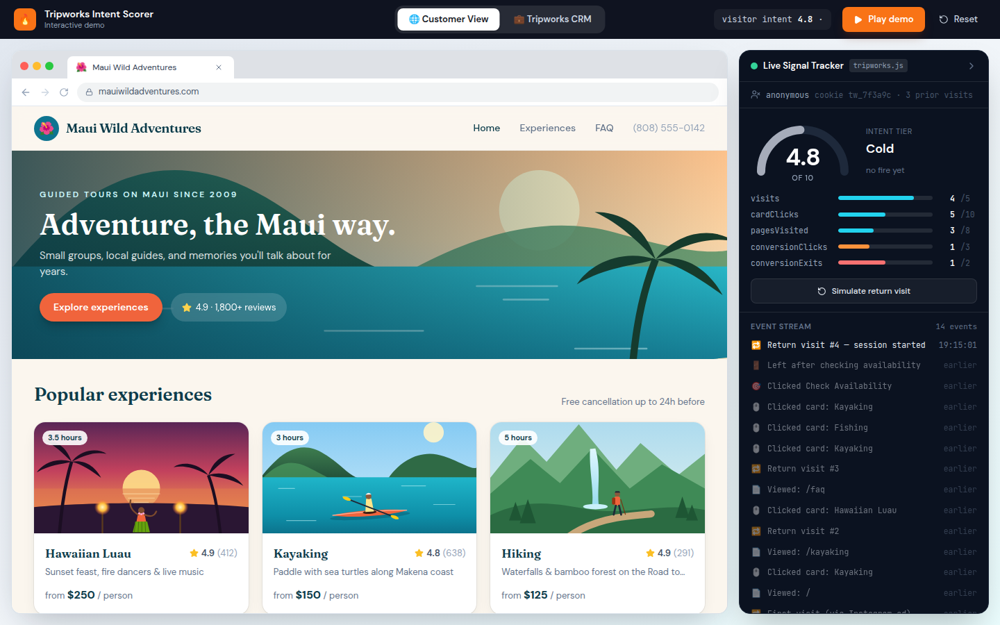
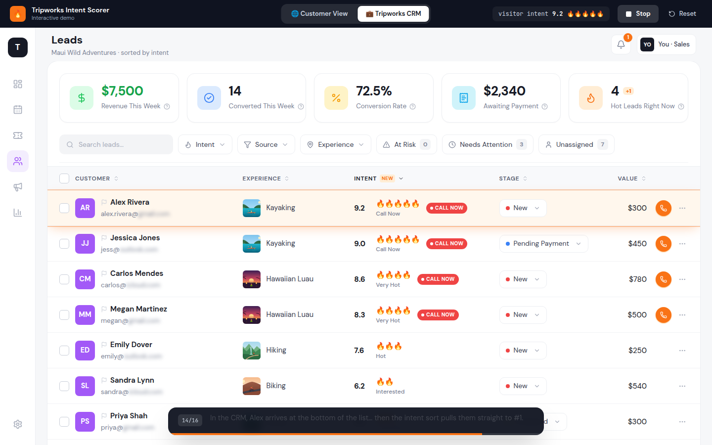

# Tripworks Intent Scorer: interactive demo

The Intent Scorer watches how a shopper behaves on a tour operator's booking site. It turns that behaviour into a **0–10 intent score** and moves the hottest leads to the top of the Tripworks CRM, so reps know who to call right now.

The demo has two scenes that share one in-memory store:

| 🌐 Customer View | 💼 Tripworks CRM |
|---|---|
|  |  |

1. **Maui Wild Adventures**, a mock operator site. A **Live Signal Tracker** on the right streams each click, page view and exit, and animates the score as it changes.
2. **Tripworks CRM.** When the visitor abandons checkout, they appear in the leads table and climb to **#1**. The row shows 🔥 emojis, a pulsing **Call now** badge and a breakdown drawer that explains the score.

---

## 1. How to run

```bash
npm install
npm run dev        # http://localhost:5173
npm test           # Vitest: scorer, explainer and seed-data tests
npm run build      # type-check + production build
```

Once it's running:

- **▶ Play demo** runs the guided journey (about 40 s) with a fake cursor and captions. It ends in the CRM with Alex at #1 on **9.2 🔥🔥🔥🔥🔥**, and the breakdown drawer opens.
- **Free play:** click around the site yourself. The same handlers run and the scoring is identical. The tab's ✕ or **Exit / Close tab** at checkout simulates abandonment. **Simulate return visit** adds a visit.
- **Reset** restores the seeded state. **Customer View ⇄ Tripworks CRM** switches scenes at any time.

Optional visual QA: with the dev server running, `npm run screenshots` drives autoplay in headless Chromium. It saves screenshots to `docs/screenshots/` and fails if autoplay takes more than 60 s or doesn't end with the new lead at #1 on 🔥🔥🔥🔥 or more. If Playwright's bundled browser isn't installed, set `CHROMIUM_PATH`.

## 2. How the score works

### In plain language

We look at five things a shopper does, and each one is worth up to a fixed share of 10 points:

- **Booking clicks** (Book Now, Check Availability, Select Date): up to **3 points**. These are the clearest sign that someone wants to buy.
- **Abandoned checkout** (clicked a booking button, then left without paying): up to **2.5 points**. These people wanted to buy and something stopped them, so they're the most urgent calls.
- **Return visits**, **experience clicks** and **pages researched**: up to **1.5 points each**. Shoppers who come back and dig into details are seriously considering a purchase.

Each signal has a cap, so no single behaviour can dominate. Ten card clicks is the ceiling, and the fifty-first click adds nothing. The rep can open any lead and see exactly which behaviours earned which points.

### The formula

`src/scoring/config.ts` holds the weights, caps and tiers. `src/scoring/scoreIntent.ts` holds the scorer, a pure function.

```
normalized_i = min(value_i / cap_i, 1)
score        = round( 10 × Σ weight_i × normalized_i , 1 decimal )
```

| Signal | Cap | Weight | Max points |
|---|---|---|---|
| `visits` | 5 | 0.15 | 1.5 |
| `cardClicks` | 10 | 0.15 | 1.5 |
| `pagesVisited` (unique paths) | 8 | 0.15 | 1.5 |
| `conversionClicks` | 3 | 0.30 | 3.0 |
| `conversionExits` | 2 | 0.25 | 2.5 |

| Score | Display | Tier |
|---|---|---|
| < 5.0 | grey "Cold" pill | Cold |
| 5.0–5.9 | 🔥 | Warm |
| 6.0–6.9 | 🔥🔥 | Interested |
| 7.0–7.9 | 🔥🔥🔥 | Hot |
| 8.0–8.9 | 🔥🔥🔥🔥 | Very Hot |
| 9.0–10 | 🔥🔥🔥🔥🔥 | Call Now |

A lead scoring 8.0 or more also gets a pulsing red **Call now** badge and a phone button on its row.

`scoreIntent(signals)` returns `{ score, tier, breakdown }`, where `breakdown` gives the points each signal contributed. The CRM drawer's bars read from it directly. The tests cover all zeros (0, Cold), all maxed (10, Call Now), values past the caps, a single conversion exit on its own (1.3), every tier boundary, and the exact before/after scores of the guided journey.

**Guided journey arithmetic.** Alex already has 3 earlier sessions, stitched together by a cookie, so the demo opens at **4.8 (Cold)**. The journey adds card clicks, new pages, three booking clicks and a second abandonment:
`0.15·4/5 + 0.15·8/10 + 0.15·7/8 + 0.30·1 + 0.25·1 = 0.921 → 9.2 (Call Now)`.

## 3. Business narrative: why this matters for tour operators

**Speed-to-lead wins bookings.** A warm lead called within minutes converts far better than one called hours later. By then the shopper has booked a competitor's kayak tour or moved on with their day. Tour and activity purchases are impulsive and time-boxed ("what are we doing Saturday?"), so a delay costs even more than it does in most sales.

**Checkout abandoners are recoverable revenue.** Someone who picked a date, entered their email and then closed the tab has already told you what they want, when they want it and how to reach them. Common blockers are a question about pickup, the kids' ages, the weather or the price for a group. A 2-minute call answers these and often closes the sale. Without a score, this person sits in the CRM looking the same as a newsletter signup.

**Reps should spend their hours on the top 10%.** Most CRMs list leads by date or alphabetically, so reps dial down the list and spend their best hours on cold leads. Sorting by intent means the first call of every session goes to the lead most likely to book. The "Hot Leads Right Now" KPI tells a manager at a glance whether the team is keeping up.

### Metrics the feature should move

| Metric | Why |
|---|---|
| **Lead-to-booking conversion rate** | Primary outcome: more of the same leads become bookings. |
| **Time-to-first-contact** (for leads scoring 8.0+) | Leading indicator: are hot leads called within minutes? |
| **Revenue per rep hour** | Efficiency: the same team closes more by calling the right people first. |
| Recovered checkout revenue | Bookings from leads with `conversionExits > 0` that closed after a call. |
| Guardrails | Refund/cancellation rate, customer complaints about calls, and conversion of *low*-score leads (make sure they aren't being neglected entirely). |

### How to A/B test it

- **Unit of randomisation: rep cohorts, not leads.** Split reps (or whole operators, if they're small) into two arms. **Control** sees the default ordering (newest first) with no intent column. **Treatment** sees intent-sorted ordering, the Intent column and the hot-lead KPI. Leads are routed to both arms the same way, so both arms get a comparable mix.
- Randomising per rep avoids contamination. A rep can't "unsee" a score on some leads and ignore it on others.
- **Primary metric:** lead-to-booking conversion within 7 days. **Secondary metrics:** time-to-first-contact for high-intent leads, and revenue per rep hour.
- Run for at least two full weekly cycles, because tour demand is strongly weekly and seasonal. Size the test from the baseline conversion rate. Stratify by operator size and season.
- Also log the score for leads in the control arm (score silently). That lets you check calibration: do 9s actually convert more often than 5s? It also tells you whether the lift comes from the ordering or from reps simply calling more.

## 4. What a production version would change

- **Real event tracking.** A lightweight JS snippet (`tripworks.js`) on operator sites and the Tripworks booking widget would batch events (`page`, `card_click`, `conversion_click`, `checkout_exit`) to an ingestion endpoint. Exits would be detected with `visibilitychange`/`pagehide` plus a server-side timeout, because "closed the tab" is never reliably reported.
- **Identity stitching.** A first-party anonymous ID in a cookie/localStorage ties sessions together. When the shopper enters an email at checkout, in a newsletter form or through a login, the anonymous history is merged into the CRM contact. Cross-device merging happens when the same email appears on another device. Respect consent (GDPR/CCPA): no tracking before opt-in where required.
- **Recency decay.** Older behaviour should count less, e.g. weight each event by `e^(-Δt/τ)` with τ ≈ 3 days, and decay `conversionExits` fastest. An abandonment from 10 minutes ago is urgent. One from three weeks ago isn't. The CRM should re-rank as scores decay.
- **Learned weights instead of hand-set ones.** Train on historical outcomes (did this lead book within N days?) using **logistic regression**, which stays explainable because each coefficient maps to a "why" bar, or **gradient-boosted trees** with SHAP values for per-lead explanations. Calibrate so the score reads as a probability. Retrain per operator segment (luau and fishing buyers behave differently) and monitor for drift.
- **More signals:** party size, lead time until the tour date, price-tier viewed, device, traffic source, email opens, and live availability. A sold-out Saturday should lower the urgency.
- **Workflow integration:** real-time push/Slack alerts when a lead crosses 8.0, auto-assignment round-robin, click-to-call logging, SMS fallback, and automatic suppression once a lead books.

## Portfolio page with recorded video

`portfolio/` is a standalone case-study page (`index.html` plus `media/`) that plays a 45-second recording of the guided demo, with clickable chapters. It has no build step, so you can upload the folder as-is (e.g. to `badriwhowonders.com/portfolio/intent-scorer/`). The video is an H.264 MP4 (1920×1200, 5 MB) with a VP9 WebM fallback.

To re-record after changing the demo: `npm run build && npx vite preview --port 4173`, then `FFMPEG=/path/to/ffmpeg npm run record`.

## Run with Docker

The image is a multi-stage build. Node runs the tests and `vite build`, then **unprivileged nginx** serves the static files on port **8080**. The final image is about 75 MB and includes a `/healthz` endpoint.

```bash
docker build -t intent-scorer .
docker run -p 8080:8080 intent-scorer          # http://localhost:8080
# or: docker compose up --build
```

| Setting | Kind | Default | Purpose |
|---|---|---|---|
| `FRAME_ANCESTORS` | runtime env | `https://badriwhowonders.com https://www.badriwhowonders.com` | Origins allowed to show the app in an `<iframe>` (sent as CSP `frame-ancestors`). Every other site is blocked. |
| `VITE_BASE` | build arg | `/` | Path the app is served from. Use `--build-arg VITE_BASE=/portfolio/intent-scorer/` when proxying under a sub-path instead of a subdomain. |

**Hosting.** Run the image on any container host (Fly.io, Render, Railway, Google Cloud Run, or a VPS behind Caddy/nginx), then point a subdomain such as `demo.badriwhowonders.com` at it. Everything runs in the browser, so one small instance is enough.

---

## Project structure

```
src/
  scoring/        config.ts (weights, caps, tiers) · scoreIntent.ts (pure scorer) · explain.ts ("Why call now") + tests
  store/          useDemoStore.ts (single Zustand store shared by both scenes) · types.ts
  data/           experiences.ts · seedLeads.ts (10 leads across every tier) · demoVisitor.ts (Alex's prior sessions)
  scenes/website/ mock operator site, browser frame, Live Signal Tracker
  scenes/crm/     leads page, KPI row, filter bar, leads table, intent breakdown drawer, sort/filter logic
  components/ui/  Avatar, KpiCard, FilterChip, StagePill, FireRating, IntentGauge, Toasts
  demo/           autoplay script, fake cursor, caption bar
scripts/          screenshots.mjs (Playwright visual QA)
portfolio/        standalone case-study page + recorded demo video
deploy/           nginx.conf.template
public/images/    hand-drawn SVG illustrations (the demo runs fully offline)
```

Design tokens for colors and radii, sampled from the Tripworks CRM reference, live in `tailwind.config.js` under `tw.*`, `tile.*` and `rounded-card / tile / ctl / avatar`.

**Tech:** React 18, Vite, TypeScript, Tailwind CSS, Framer Motion (row re-order via `layout`, scene transitions, gauges) and Zustand. There is no backend. All data is mocked in memory.
